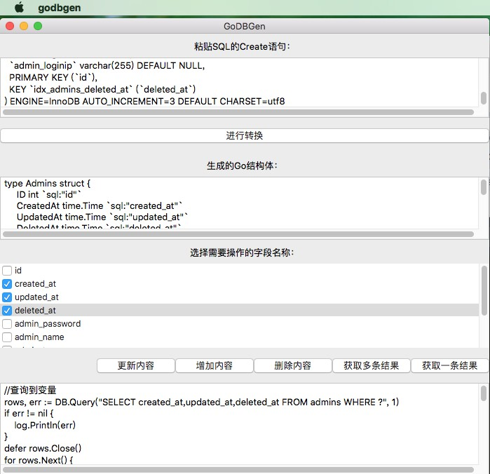

# GoDBGen

根据SQL语句生成Go结构体，并生成对应的增删改查语句

## 截图

## 感谢

[GoVCL](https://github.com/ying32/govcl/) A cross-platform Golang GUI library. Use Delphi VCL and Lazarus LCL for binding.

[SQLParser](https://github.com/xwb1989/sqlparser) SQL Parser implemented in Go